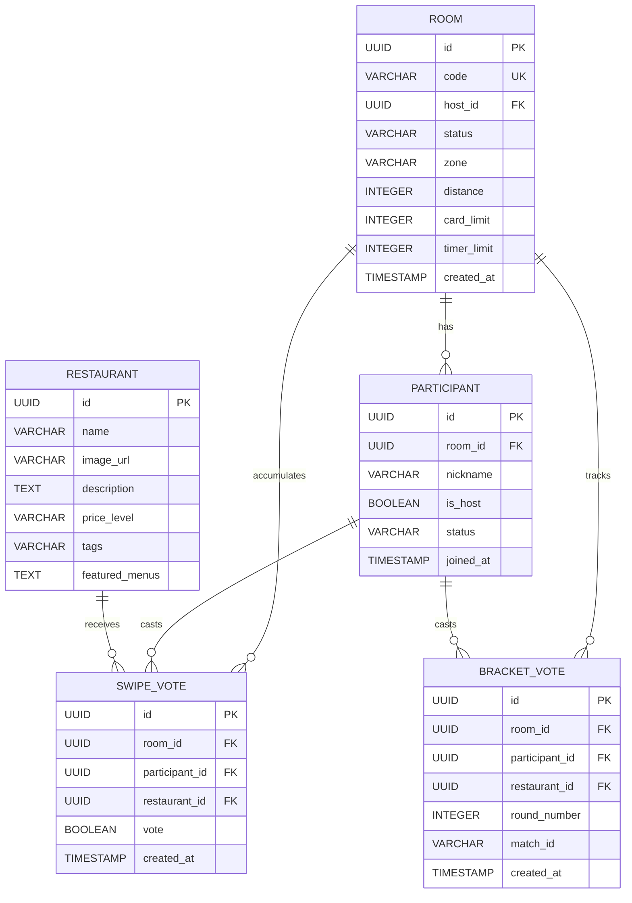

# Data Model: Ginder (อะไรก็ได้)

This document describes the logical data model, entity relationships, and constraints.

---

## 1. Entity List

### Room
- **Description:** A dining session room created by a host.
- **Attributes:**
  - `id`: UUID (Primary Key)
  - `code`: VARCHAR(4) (Unique room access code, e.g., `B3Z9`)
  - `host_id`: UUID (Foreign Key to Participant)
  - `zone`: VARCHAR(100) (Target location area)
  - `distance`: INTEGER (Distance limit in kilometers)
  - `categories`: VARCHAR(255) (JSON string/comma-separated list of selected food types)
  - `card_limit`: INTEGER (Max cards per swiping round)
  - `timer_limit`: INTEGER (Countdown in seconds)
  - `status`: VARCHAR(20) (`LOBBY`, `SWIPING`, `RESOLVING`, `COMPLETED`)
  - `created_at`: TIMESTAMP

### Participant
- **Description:** An active user participating in a Room.
- **Attributes:**
  - `id`: UUID (Primary Key)
  - `room_id`: UUID (Foreign Key to Room)
  - `nickname`: VARCHAR(50)
  - `is_host`: BOOLEAN
  - `status`: VARCHAR(20) (`CONNECTED`, `READY`, `SWIPING_DONE`, `DISCONNECTED`)
  - `joined_at`: TIMESTAMP

### Restaurant
- **Description:** A restaurant candidate available for swiping.
- **Attributes:**
  - `id`: UUID (Primary Key)
  - `name`: VARCHAR(100)
  - `image_url`: VARCHAR(255)
  - `description`: TEXT
  - `price_level`: VARCHAR(5) (e.g., `฿`, `฿฿`, `฿฿฿`)
  - `tags`: VARCHAR(255) (comma-separated list, e.g., `Thai,Halal,Spicy`)
  - `featured_menus`: TEXT (JSON array of menu items containing `{name, price, image}`)

### SwipeVote
- **Description:** A swipe decision recorded for a participant on a restaurant.
- **Attributes:**
  - `id`: UUID (Primary Key)
  - `room_id`: UUID (Foreign Key to Room)
  - `participant_id`: UUID (Foreign Key to Participant)
  - `restaurant_id`: UUID (Foreign Key to Restaurant)
  - `vote`: BOOLEAN (TRUE for right swipe / like, FALSE for left swipe / dislike)
  - `created_at`: TIMESTAMP

### BracketVote
- **Description:** A tournament matchup vote.
- **Attributes:**
  - `id`: UUID (Primary Key)
  - `room_id`: UUID (Foreign Key to Room)
  - `round_number`: INTEGER (e.g., 1, 2, 3)
  - `match_id`: VARCHAR(50) (e.g., `R1-M1`)
  - `participant_id`: UUID (Foreign Key to Participant)
  - `restaurant_id`: UUID (Foreign Key to Restaurant - the voted option)
  - `created_at`: TIMESTAMP

---

## 2. Relationships

- **Room → Participant:** 1 : N (One room has many participants)
- **Room → SwipeVote:** 1 : N (One room accumulates many swipe votes)
- **Participant → SwipeVote:** 1 : N (One participant casts many swipe votes)
- **Restaurant → SwipeVote:** 1 : N (One restaurant receives many swipe votes)
- **Room → BracketVote:** 1 : N (One room has many bracket votes)
- **Participant → BracketVote:** 1 : N (One participant casts many bracket votes)

---

## 3. Entity-Relationship Diagram

---

## 4. Integrity Constraints

- **Unique Room Code:** `ROOM.code` must be unique across active rooms.
- **Foreign Key Constraints:**
  - `PARTICIPANT.room_id` references `ROOM.id` with `ON DELETE CASCADE`.
  - `SWIPE_VOTE.participant_id` references `PARTICIPANT.id` with `ON DELETE CASCADE`.
  - `SWIPE_VOTE.restaurant_id` references `RESTAURANT.id` with `ON DELETE RESTRICT`.
  - `BRACKET_VOTE.participant_id` references `PARTICIPANT.id` with `ON DELETE CASCADE`.
- **Nickname Uniqueness per Room:** `PARTICIPANT(room_id, nickname)` must be unique (case-insensitive) to prevent name collisions in the same lobby.
