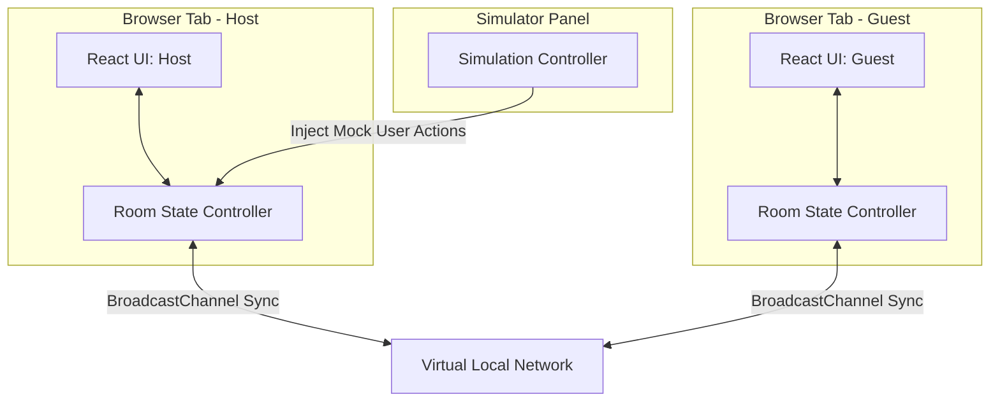

# Architecture Summary: AraiKeeDai (อะไรก็ได้)

This document describes the technical architecture, project directory layout, and communication channels for the AraiKeeDai prototype.

---

## 1. System Architecture Diagram



---

## 2. Technology Stack

- **Framework:** React (Vite)
- **Programming Language:** JavaScript (ES6+)
- **Styling:** Vanilla CSS (CSS Variables, Flexbox, CSS Grid, Glassmorphic overlays)
- **Local Synchronization:** HTML5 `BroadcastChannel` API for multi-tab real-time state synchronization (allows opening two or more tabs to simulate real-time room communication on localhost without installing a database server).
- **Reload Resilience:** HTML5 `sessionStorage` API persists active room parameters, votes, roles, and status *per tab*. If a user reloads their browser, they resume exactly where they left off without disconnecting.
- **Active Public Rooms Registry:** HTML5 `localStorage` API acts as a client-side shared repository. Hosts publish active heartbeats, and the Home screen queries this registry to display available rooms dynamically.
- **Fallback / Simulation Engine:** Client-side Mock Player Engine (Host can spawn mock bots that vote automatically to showcase the tournament/bracket flow instantly).

---

## 3. Directory Layout

```text
src/
├── components/          # Reusable UI components
│   ├── BracketView.jsx  # Single-elimination tournament bracket
│   ├── LobbyView.jsx    # Room lobby for host and guests
│   ├── MatchSimulator.jsx # Panel to simulate other players
│   ├── SwipeCard.jsx    # Tinder-like restaurant swiping card
│   └── WinnerView.jsx   # Winner declaration page
├── data/
│   └── restaurants.js   # Rich mock database of restaurants and menus
├── hooks/
│   └── useRoomState.js  # React hook for room state sync via BroadcastChannel
├── App.jsx              # Main App wrapper & view switcher
├── index.css            # Central stylesheet (theme, gradients, animations)
└── main.jsx             # React entrypoint
```

---

## 4. Real-time Communication Protocols (Synchronized State)

To avoid requiring an external WebSockets server, we use the browser's native `BroadcastChannel` API.
Whenever a state change occurs (e.g. participant joins, settings change, swipe vote submitted, bracket vote cast), a message is broadcast to the channel `araikeedai-room-[roomCode]`.
All listening tabs catch the event and update their local states accordingly.

### Message Formats:
- **`JOIN_ROOM`**: `{ type: 'JOIN_ROOM', nickname, id }`
- **`UPDATE_SETTINGS`**: `{ type: 'UPDATE_SETTINGS', settings }`
- **`START_SWIPING`**: `{ type: 'START_SWIPING' }`
- **`SUBMIT_SWIPES`**: `{ type: 'SUBMIT_SWIPES', participantId, votes: { [restaurantId]: boolean } }`
- **`SUBMIT_BRACKET_VOTE`**: `{ type: 'SUBMIT_BRACKET_VOTE', participantId, matchId, restaurantId }`
